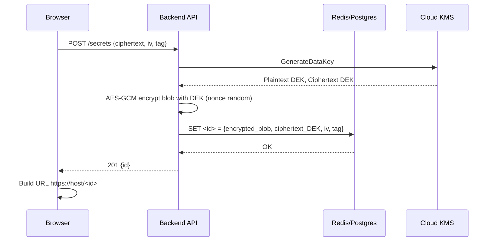
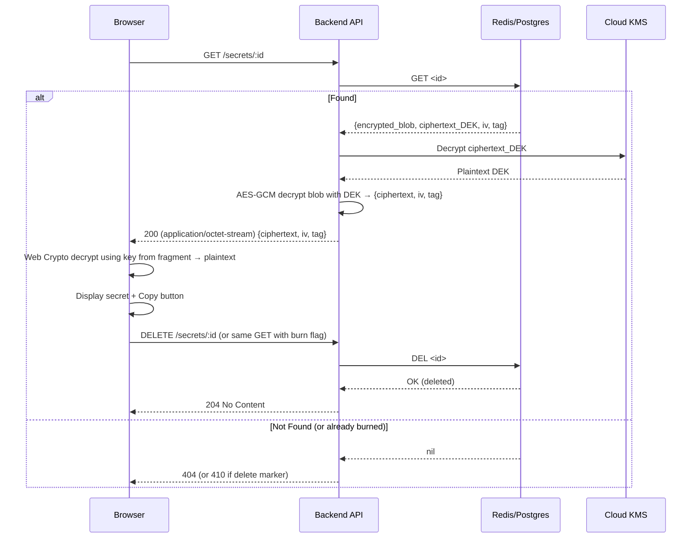
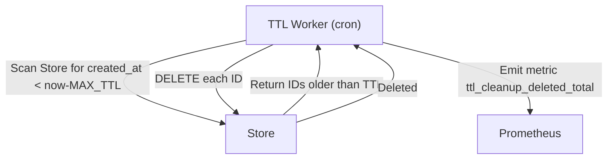

# System Architecture – One‑Time Secret Sharing Service  
*Engineering‑ready blueprint derived from the Phase‑2 PRD*  

---  

## 1. High‑Level Architecture  

```mermaid
C4Context
    title System Context Diagram (V1)
    Person(dev, "Developer (creator)", "Creates a secret link")
    Person(recipient, "Recipient (general audience)", "Views the secret via URL")
    System_Boundary(b0, "Secret Sharing Service") {
        System(ui, "Web Frontend (SPA)", "React/Vue app – runs in browser")
        System(api, "Backend API", "REST‑like service (Go/Node)")
        System(store, "Encrypted Blob Store", "Redis (primary) + optional PostgreSQL fallback")
        System(kms, "Key Management Service", "Cloud KMS (AWS KMS / GCP KMS / Azure Key Vault)")
        System(logger, "Observability Stack", "Prometheus + Grafana + Loki (JSON logs)")
    }
    Extremal_System(net, "Internet", "HTTPS only")
    Rel(dev, ui, "Loads SPA, creates secret", "HTTPS")
    Rel(ui, api, "POST /secrets (ciphertext+iv+tag)", "HTTPS")
    Rel(api, store, "Write encrypted blob", "Internal RPC/TCP")
    Rel(api, kms, "Encrypt/Decrypt DEK (envelope)", "Internal RPC/TCP")
    Rel(recipient, ui, "Loads URL, extracts ID/key", "HTTPS")
    Rel(ui, api, "GET /secrets/:id (ciphertext)", "HTTPS")
    Rel(api, store, "Read encrypted blob", "Internal RPC/TCP")
    Rel(api, store, "DELETE /secrets/:id (burn)", "Internal RPC/TCP")
    Rel(api, logger, "Emit JSON log lines", "Stdout → Loki")
    Rel(ui, logger, "Client‑side metrics beacon", "HTTPS (optional)")
```

*Key points*  

* **Frontend** runs entirely in the browser – no secrets ever leave the client.  
* **Backend** is a thin stateless API that only persists encrypted blobs and enforces the burn‑after‑read contract.  
* **Storage** holds only the ciphertext (already client‑encrypted) plus an optional server‑side envelope encryption layer.  
* **KMS** provides a data‑encryption key (DEK) that never leaves the cloud provider; the backend only ever sees the DEK encrypted by the KMS.  
* **Observability** collects anonymized metrics and logs (no IPs, user‑agents, or secret material).  

---  

## 2. Architecture Pattern  

| Pattern | Choice | Justification |
|---------|--------|---------------|
| **Microservices‑lite** (API + Worker) | **Chosen** | The service can be split into two independently scalable units: <br>1. **API layer** (stateless request handling) <br>2. **TTL‑cleanup worker** (background job). This gives us horizontal scalability for the request path while keeping operational complexity low. |
| **Alternative considered** | Monolith | Simpler to deploy but would couple the cleanup worker to request latency and make scaling the API harder. |
| **Alternative considered** | Serverless (FaaS) | Attractive for spiky traffic, but introduces cold‑start latency that could jeopardize the ≤200 ms read‑latency SLA and adds complexity for envelope‑encryption key handling. |

**Trade‑offs**  

* **Pros** – Independent scaling, clear failure boundaries, easy to replace the worker with a different technology (e.g., Go → Rust) without touching the API.  
* **Cons** – Slightly more moving parts (need service discovery or simple DNS‑based load balancing). Mitigated by using a managed container orchestrator (Kubernetes) or a fully‑managed service (AWS ECS/Fargate, Cloud Run).  

---  

## 3. Layer Breakdown  

### 3.1 Presentation Layer (Frontend)  

| Item | Recommendation | Reason |
|------|----------------|--------|
| Framework | **React 18** (with Vite) **or** Vue 3 (Composition API) – pick based on team expertise | Mature ecosystem, excellent TypeScript support, small bundle size. |
| State Management | **React Context + useReducer** (or Vue Pinia) – only needs to hold UI state (form, loading, error) | No global cache needed; data flows linearly from form → API → display. |
| Styling | **Tailwind CSS** (utility‑first) + **Headless UI** for accessible components | Rapid responsive design, minimal CSS overhead. |
| Crypto | Native **Web Crypto API** (AES‑GCM‑256) wrapped in a tiny helper (`crypto.subtle`) | No external dependencies, works in all modern browsers. |
| Clipboard | `navigator.clipboard.writeText()` (fallback to execCommand for older Safari) | Standard, permission‑based, works on mobile. |
| Build | Vite → ES modules, production build with `vite build` → static assets served from same origin (CSP friendly). | Fast dev server, tree‑shaking, easy CDN upload. |

### 3.2 API Layer  

| Item | Recommendation | Reason |
|------|----------------|--------|
| Protocol | **REST/JSON** (POST `/secrets`, GET `/secrets/:id`, DELETE `/secrets/:id`) | Simple, cache‑friendly, easy to debug; no need for GraphQL complexity. |
| Authentication | **None** (public endpoint) – security relies on URL fragment secrecy. | Matches threat model. |
| Transport | **HTTPS only**, enforce HSTS, redirect HTTP → HTTPS. | Prevents MITM. |
| Headers | `Content-Type: application/json` for request/response; `Content-Type: application/octet-stream` for blob GET. | Clear contract. |
| Rate Limiting | **Not implemented in V1** (see Out‑of‑Scope) – can be added later via API gateway (e.g., AWS API Gateway, Kong). |
| Validation | JSON schema (ajoy) for POST body; UUID validation for ID path param. | Prevents malformed data. |
| Error Responses | RFC‑7807 Problem JSON (`{type, title, status, detail}`) – no stack traces. | Consistent, machine‑readable. |
| Observability | Emit structured JSON logs to stdout; expose `/metrics` (Prometheus) for request counters, latency histograms, delete‑vs‑read ratio. | Enables alerting and dashboards. |

### 3.3 Business Logic Layer  

| Component | Responsibility |
|-----------|-----------------|
| **SecretService** (API handler) | • Validate incoming ciphertext/iv/tag <br>• Generate UUIDv4 ID <br>• Call **EnvelopeEncryptor** to protect blob with server‑side DEK <br>• Persist encrypted blob to **BlobStore** <br>• On GET: retrieve blob, call **EnvelopeDecryptor**, return raw ciphertext <br>• On DELETE: hard‑remove record from store, emit audit log |
| **EnvelopeEncryptor/Decryptor** | • Request a fresh DEK from KMS (GenerateDataKey) <br>• Encrypt blob with DEK using AES‑GCM (nonce = random 12‑byte) <br>• Store DEK ciphertext alongside blob (or store only DEK ciphertext and keep blob encrypted with client key only – both are acceptable) <br>• Decrypt: ask KMS to decrypt DEK ciphertext, then decrypt blob |
| **TTLWorker** (background) | • Periodically scan store for records older than `MAX_TTL` (e.g., 24 h) <br>• Delete them (hard delete) <br>• Emit metric `ttl_cleanup_deleted_total` |
| **HealthChecker** | • Simple `/healthz` endpoint returning 200 if API + store + KMS reachable. |

### 3.4 Data Layer  

| Item | Recommendation | Reason |
|------|----------------|--------|
| Primary Store | **Redis (AWS Elasticache / GCP Memorystore / Azure Redis)** – use `SET` with binary value, `GET`, `DEL`. | O(1) latency, built‑in TTL (`EXPIRE`) can be used as a safety net; supports high read/write throughput. |
| Fallback / Durability | **PostgreSQL (RDS / Cloud SQL)** – table `secrets(id UUID PK, blob BYTEA, created_at TIMESTAMP)`. | Guarantees durability if Redis persistence is disabled; can be used as primary if team prefers SQL. |
| Encryption at Rest | Enable **Redis‑Enterprise** encryption‑at‑rest or rely on cloud provider’s encrypted storage; additionally encrypt blob via KMS envelope (defense‑in‑depth). | Defense‑in‑depth against storage compromise. |
| Backup | Redis snapshots (RDB) + WAL for PostgreSQL; retained 7 days, encrypted with KMS. | Meets operational recovery SLA. |
| Cache Layer | None needed beyond Redis itself; optional CDN for static assets (see Infra). | Static assets are immutable and can be aggressively cached. |

---  

## 4. Key Components & Communication  

| Component | Tech | Responsibility | Communication |
|-----------|------|----------------|---------------|
| **SPA (Web Frontend)** | React/Vue + TypeScript + Vite | UI, client‑side AES‑GCM, URL fragment handling, copy‑to‑clipboard, metrics beacon | HTTPS → API (POST/GET/DELETE) |
| **API Server** | Go 1.22 (net/http) **or** Node.js 20 (Fastify) | Request validation, envelope encryption delegation, store interaction, logging, metrics | Internal TCP/Redis (or PostgreSQL) <br> Internal gRPC/HTTP to KMS provider SDK |
| **Blob Store** | Redis (cluster mode) | Store ciphertext blob (bytes) keyed by UUID; TTL safety net | API ↔ Redis (TCP) |
| **PostgreSQL (optional fallback)** | Managed RDS | Durable storage of blob if Redis unavailable | API ↔ PostgreSQL (TCP) |
| **KMS** | AWS KMS / GCP Cloud KMS / Azure Key Vault | GenerateDataKey, Decrypt (for envelope) | API ↔ KMS (HTTPS via SDK) |
| **TTL Cleanup Worker** | Same language as API (Go/Node) | Scan & delete expired records | Worker ↔ Redis/PostgreSQL (TCP) <br> Worker → KMS (only if needed for logging) |
| **Observability Stack** | Prometheus + Grafana + Loki (or CloudWatch/Stackdriver) | Metrics collection, log aggregation, alerting | API & Worker → stdout → Loki <br> Prometheus scrapes `/metrics` endpoint |
| **CI/CD** | GitHub Actions (or GitLab CI) | Build Docker images, run unit/integration tests, push to registry, deploy via Helm/Kustomize | CI → Container Registry → Kubernetes (or ECS/Fargate) |
| **Ingress / Load Balancer** | Cloud LB (AWS ALB / GCP Cloud Load Balancing / Azure Front Door) | TLS termination, HTTP→HTTPS redirect, sticky‑session not needed (stateless) | Internet ↔ LB ↔ API Pods |

**Communication Patterns**  

* **Synchronous request/response** for all user‑initiated flows (create, read, burn).  
* **Asynchronous background job** (TTL worker) uses simple polling or Redis `KEYSCAN`/`SCAN` with a sleep interval; no message queue needed for V1.  
* **Observability** uses **push** (stdout → Loki) and **pull** (Prometheus scrape).  

---  

## 5. Data Flow  

### 5.1 Secret Creation (Creator Flow)  



*Notes*  

* The **key** used for client encryption is the random symmetric key generated in the browser (never sent).  
* The **DEK** is only used to add a server‑side layer; the blob stored is `Encrypt_DEK( ciphertext || iv || tag )`.  

### 5.2 Secret Retrieval & Burn (Recipient Flow)  



*Error paths*  

* Crypto failure → API returns 500 with generic error; browser shows “Unable to retrieve secret”.  
* Missing ID → 404.  
* Already burned → 410 (Gone).  

### 5.3 TTL Cleanup (Background)  



---  

## 6. Scalability & Performance  

| Concern | Solution | Details |
|---------|----------|---------|
| **Read/Write Throughput** | Horizontal scaling of API pods behind a stateless LB. Redis can handle >100k ops/sec per shard; cluster mode enables linear scaling. | Target V1 load: < 5k RPM (requests per minute) – well within a single Redis node; design allows scaling to 100k+ RPM. |
| **Latency** | • Keep API < 2 ms processing (pure Go/Node). <br>• Redis < 1 ms network latency (same‑AZ). <br>• TLS termination at LB (hardware offload). <br>• Client‑side crypto ~0.5‑2 ms (Web Crypto). | End‑to‑end 95th‑pctile ≤ 200 ms achievable. |
| **Cache** | Redis itself acts as the hot store; static assets served via CDN (CloudFront / Cloud CDN) with long‑term caching. | Reduces origin load for SPA assets. |
| **Bottleneck Mitigation** | • KMS calls are only for envelope encryption/decryption (2 per request). Use regional KMS endpoint; latency ~ 1‑2 ms. <br>• If KMS becomes a limit, switch to **local AEAD key rotation** (derive DEK from a master key stored in KMS, cached in memory) – still KMS‑wrapped but reduces calls. |
| **Load Shedding** | API returns 429 if concurrent request count > threshold (configurable). Can be added later via API gateway. |
| **Database Resilience** | Redis replica‑of‑one for read‑scale; automatic failover via Elasticache Multi‑AZ. PostgreSQL uses managed standby with automatic failover. | Guarantees availability > 99.9 % monthly. |
| **Network** | All inter‑service traffic stays within the same VPC/private subnet; only ingress/egress goes through the LB with TLS. | Minimizes latency and exposure. |

---  

## 7. Infrastructure Recommendations  

| Layer | Options (cloud‑agnostic) | Recommended Default (if no preference) |
|-------|--------------------------|----------------------------------------|
| **Compute** | AWS ECS/Fargate, GCP Cloud Run, Azure Container Apps, or self‑managed Kubernetes (EKS/GKE/AKS). | **Kubernetes** (managed) – gives portability, fine‑grained scaling, and easy batch worker deployment. |
| **Container Image** | Multi‑stage Dockerfile (builder → distroless). | Base: `golang:1.22-alpine`