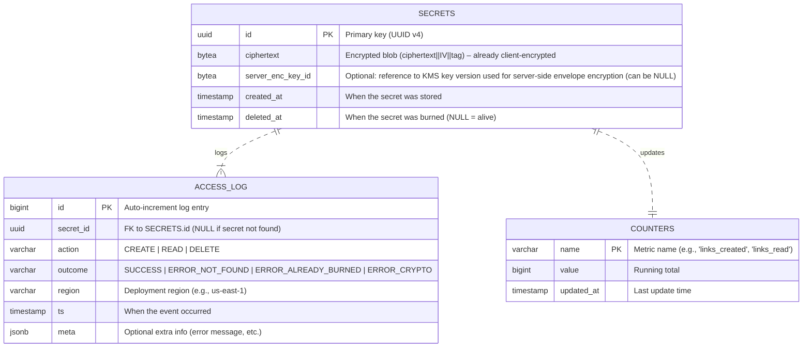

## Database Design – One‑Time‑Secret Sharing Service  

Below is a **complete, engineering‑ready schema** that satisfies every functional and non‑functional requirement in the PRD.  
The design is deliberately simple – the service only needs to store an immutable encrypted blob keyed by a UUID and delete it on first successful read (or after a safety TTL).  
All tables are defined for **PostgreSQL 15** (the same DDL works on Amazon Aurora‑PostgreSQL, Google Cloud SQL‑PostgreSQL, Azure Database for PostgreSQL, or a self‑managed instance).  
If you prefer a pure key‑value store (Redis, DynamoDB, etc.) you can map the same concepts directly; the relational version gives you built‑in constraints, easy analytics, and audit logging without extra moving parts.

---

### 1. Database Selection & Justification  

| Choice | Reasoning |
|--------|-----------|
| **Primary store:** PostgreSQL (SQL) | • ACID guarantees make the “read‑then‑delete” operation atomic (prevents race‑conditions). <br>• Native `UUID` and `BYTEA` types fit the ID and ciphertext blob. <br>• Built‑in support for TTL‑like cleanup via a periodic `DELETE … WHERE created_at < now() - interval '24h'`. <br>• Easy to add secondary tables for analytics & operational logs without a separate system. |
| **Alternative (if you need sub‑millisecond latency & massive scale):** Redis with `EXPIRE` on read or a TTL field, or DynamoDB with TTL attribute. <br>Both would require an extra layer for audit logs & counters. |
| **Server‑side encryption of the blob:** Handled by the application layer (envelope encryption via KMS). The DB only sees the already‑encrypted ciphertext; no special column type needed. |
| **Analytics counters:** Simple `counters` table (or a separate Prometheus pushgateway). Keeps everything in one backup/restore unit. |
| **Operational logs:** `access_log` table – lightweight, JSON‑friendly, retained 7 days via a scheduled job. |

**Trade‑offs**  
*SQL vs NoSQL*: SQL gives us referential integrity, easy ad‑hoc reporting, and deterministic delete‑after‑read semantics. The trade‑off is slightly higher storage overhead (indexes, MVCC) – negligible for the expected data volume (≤ 10 KB per secret, millions of rows still fit comfortably on a modest instance).  
*Strong consistency vs eventual consistency*: We need strong consistency for the burn‑after‑read guarantee; PostgreSQL’s READ COMMITTED (or REPEATABLE READ) isolation gives us that.  

---

### 2. Entity‑Relationship Diagram (Mermaid)



*Notes*  

* `SECRETS.server_enc_key_id` is optional – you can store the KMS key version or key ARN used for the envelope encryption; if you rely solely on client‑side encryption, leave it `NULL`.  
* `ACCESS_LOG.secret_id` is nullable because a failed read (unknown ID) still creates a log entry but there is no secret row to point to.  

---

### 3. Table / Collection Schemas  

#### 3.1 `secrets` – core storage  

```sql
CREATE TABLE secrets (
    id              UUID PRIMARY KEY DEFAULT gen_random_uuid(),   -- UUID v4
    ciphertext      BYTEA NOT NULL,                              -- ciphertext || IV || tag (max ~10KB+32)
    server_enc_key_id TEXT,                                     -- KMS key version/ARN (nullable)
    created_at      TIMESTAMPTZ NOT NULL DEFAULT now(),
    deleted_at      TIMESTAMPTZ NULL                             -- set on burn‑after‑read
);

-- Helper: a secret is considered "alive" if deleted_at IS NULL
CREATE INDEX idx_secrets_alive ON secrets (deleted_at) WHERE deleted_at IS NULL;
```

**Field description**

| Column | Type | Constraints | Purpose |
|--------|------|-------------|---------|
| `id` | `UUID` | `PK`, `DEFAULT gen_random_uuid()` | Unguessable identifier used in the URL path. |
| `ciphertext` | `BYTEA` | `NOT NULL` | The encrypted blob produced by the browser (AES‑GCM ciphertext ‖ IV ‖ tag). Max size ≈ 10 KB + 32 B. |
| `server_enc_key_id` | `TEXT` | `NULL` allowed | Identifier of the server‑side KMS key version used for envelope encryption (defense‑in‑depth). |
| `created_at` | `TIMESTAMPTZ` | `NOT NULL`, `DEFAULT now()` | Timestamp for TTL cleanup and analytics. |
| `deleted_at` | `TIMESTAMPTZ` | `NULL` allowed | Set to `now()` when the secret is burned; enables soft‑delete for audit while still allowing a hard‑delete later. |

**Example row (pretty‑printed)**  

| id                                 | ciphertext (first 32 B hex) | server_enc_key_id | created_at               | deleted_at |
|------------------------------------|-----------------------------|-------------------|--------------------------|------------|
| `3fa85f64-5717-4562-b3fc-2c963f66afa6` | `a1b2c3d4…` (≈10 KB) | `projects/my-proj/locations/global/keyRings/secrets/cryptoKeys/secret-enc-key/versions/1` | `2025-08-27 14:03:12+00` | `NULL` |

---

#### 3.2 `counters` – simple aggregated metrics  

```sql
CREATE TABLE counters (
    name        VARCHAR(50) PRIMARY KEY,   -- e.g., 'links_created', 'links_successful_read', 'links_burned', 'errors_crypto'
    value       BIGINT NOT NULL DEFAULT 0,
    updated_at  TIMESTAMPTZ NOT NULL DEFAULT now()
);

-- Optional: a view for pretty reporting
CREATE OR REPLACE VIEW v_counter_snapshot AS
SELECT name, value, to_char(updated_at, 'YYYY-MM-DD HH24:MI:SS') AS updated_at
FROM counters
ORDER BY name;
```

**Typical rows**

| name                | value | updated_at          |
|---------------------|-------|---------------------|
| links_created       | 12457 | 2025-08-27 14:05:00 |
| links_successful_read| 9832 | 2025-08-27 14:04:58 |
| links_burned        | 9831 | 2025-08-27 14:04:57 |
| errors_crypto       | 12   | 2025-08-27 14:03:45 |
| errors_not_found    | 5    | 2025-08-27 14:02:10 |

*Update strategy*: each API handler increments the appropriate counter **inside the same transaction** as the secret operation (e.g., `INSERT … RETURNING id` then `UPDATE counters SET value = value + 1 WHERE name = 'links_created'`). This guarantees the counters stay consistent even under high concurrency.

---

#### 3.3 `access_log` – operational audit (anonymized)  

```sql
CREATE TABLE access_log (
    id          BIGSERIAL PRIMARY KEY,
    secret_id   UUID REFERENCES secrets(id) ON DELETE SET NULL,
    action      VARCHAR(10) NOT NULL CHECK (action IN ('CREATE','READ','DELETE')),
    outcome     VARCHAR(20) NOT NULL CHECK (outcome IN (
        'SUCCESS',
        'ERROR_NOT_FOUND',
        'ERROR_ALREADY_BURNED',
        'ERROR_CRYPTO',
        'ERROR_STORAGE'
    )),
    region      VARCHAR(20) NOT NULL,          -- e.g., 'us-east-1'
    ts          TIMESTAMPTZ NOT NULL DEFAULT now(),
    meta        JSONB                           -- free‑form, e.g., {error_message: "..."}
);

-- Indexes for common log queries
CREATE INDEX idx_access_log_ts      ON access_log (ts DESC);
CREATE INDEX idx_access_log_secret  ON access_log (secret_id) WHERE secret_id IS NOT NULL;
CREATE INDEX idx_access_log_action  ON access_log (action, outcome);
```

**Field description**

| Column | Type | Constraints | Purpose |
|--------|------|-------------|---------|
| `id` | `BIGSERIAL` | `PK` | Monotonically increasing log identifier (useful for tailing). |
| `secret_id` | `UUID` | `FK → secrets.id`, `ON DELETE SET NULL` | Links log entry to the secret when it exists; `NULL` for “unknown ID” attempts. |
| `action` | `VARCHAR(10)` | `CHECK` | Type of request (`CREATE`, `READ`, `DELETE`). |
| `outcome` | `VARCHAR(20)` | `CHECK` | Result of the action – all values are anonymized; no IP or UA. |
| `region` | `VARCHAR(20)` | `NOT NULL` | Deployment region / availability zone for multi‑region debugging. |
| `ts` | `TIMESTAMPTZ` | `NOT NULL DEFAULT now()` | Event timestamp. |
| `meta` | `JSONB` | `NULL` allowed | Optional structured payload (e.g., error message, stack‑trace‑free diagnostic). |

**Retention** – a nightly job deletes rows older than 7 days:

```sql
DELETE FROM access_log
WHERE ts < now() - interval '7 days';
```

---

### 4. Data Types & Constraints – Rationale  

| Column | Chosen Type | Why |
|--------|-------------|-----|
| `id` | `UUID` | 128‑bit random, unguessable, fits URL path; `gen_random_uuid()` provides cryptographically‑secure v4 UUIDs. |
| `ciphertext` | `BYTEA` | Binary opaque data; PostgreSQL stores it efficiently (TOASTed if > 2 KB). Max size ≈ 10 KB + 32 B well within TOAST limits. |
| `server_enc_key_id` | `TEXT` | Stores a KMS key ARN or version string; variable length, no need for fixed size. |
| `created_at`, `deleted_at`, `ts` | `TIMESTAMPTZ` | Timezone‑aware timestamps avoid ambiguity across regions; essential for TTL jobs and log correlation. |
| `counters.value` | `BIGINT` | Expected totals can easily exceed 2³‑1 (≈2 B) over the service lifetime; `BIGINT` is safe. |
| `access_log.id` | `BIGSERIAL` | 64‑bit auto‑increment gives > 10¹⁹ rows before wrap‑around – more than enough for years of logging. |
| `action` / `outcome` | `VARCHAR` with `CHECK` | Enforces a closed set of values at the DB level, preventing typos. |
| `meta` | `JSONB` | Flexible, indexable (GIN) if we ever need to query inside the payload; otherwise just stored as‑is. |

**Validation rules enforced at the DB level**

* `secrets.ciphertext` length is implicitly limited by `max bytea` (1 GB) – far above our 10 KB limit; application validates size before insert.  
* `counters.name` limited to 50 chars – enough for metric identifiers.  
* `access_log.action` and `outcome` constrained via `CHECK`.  
* Referential integrity: `access_log.secret_id` points to `secrets.id`; on secret deletion we keep the log (`ON DELETE SET NULL`) so audit trails remain intact.  

**Character encoding & timezone**

* Database encoding set to `UTF8` (default). All text columns (`TEXT`, `VARCHAR`, `JSONB`) store UTF‑8.  
* Timestamps are `TIMESTAMPTZ`; application always supplies or reads timestamps in UTC (`now()` returns UTC‑zoned value). No need for client‑side timezone conversion.

---

### 5. Indexing Strategy  

| Table | Index | Type | Columns | Purpose |
|-------|-------|------|---------|---------|
| `secrets` | `PK_secrets` | B‑tree | `id` | Primary key look‑up (`GET /secrets/:id`). |
| `secrets` | `idx_secrets_alive` | Partial B‑tree | `deleted_at` WHERE `deleted_at IS NULL` | Fast scan for TTL cleanup job (`WHERE deleted_at IS NULL AND created_at < now() - interval '24h'`). |
| `counters` | `PK_counters` | B‑tree | `name` | Direct metric updates/reads. |
| `access_log` | `PK_access_log` | B‑tree | `id` | Sequential log ingestion. |
| `access_log` | `idx_access_log_ts` | B‑tree | `ts DESC` | Recent‑log queries (e.g., last hour). |
| `access_log` | `idx_access_log_secret` | B‑tree | `secret_id` WHERE `secret_id IS NOT NULL` | Lookup all logs for a given secret (useful for debugging). |
| `access_log` | `idx_access_log_action_outcome` | B‑tree | `action, outcome` | Aggregated error‑rate queries. |
| (Optional) `access_log` | `idx_access_log_meta_gin` | GIN | `meta` | If you ever need to query inside the JSON payload (e.g., find all logs with a specific error message). |

**Performance impact**  
* Primary key look‑ups are O(log N) with negligible overhead (< 0.1 ms) even for tens of millions of rows.  
* Partial index on `deleted_at IS NULL` keeps the TTL cleanup scan small – only “alive” rows are examined.  
* Log indexes are write‑heavy but still cheap: each insert updates three B‑tree pages (PK, ts, secret_id) – well within the write capacity of a modest RDS instance (≈ 5 k writes/s).  

---

### 6. Data Relationships & Integrity  

| Relationship | FK | Action on Delete | Reason |
|--------------|----|------------------|--------|
| `access_log.secret_id → secrets.id` | `ON DELETE SET NULL` | When a secret is burned (hard‑deleted), we keep the log entry but nullify the FK so the log remains usable for audit. |
| No other FKs needed – counters and logs are independent. | | | |

**Consistency guarantees**  

* The **burn‑after‑read** operation is performed inside a single transaction:  

  ```sql
  BEGIN;
  SELECT ciphertext FROM secrets WHERE id = $1 AND deleted_at IS NULL FOR UPDATE;
  -- if row found:
  UPDATE secrets SET deleted_at = now() WHERE id = $1;
  UPDATE counters SET value = value + 1 WHERE name = 'links_burned';
  INSERT INTO access_log (secret_id, action, outcome, region) VALUES ($1, 'DELETE', 'SUCCESS', $region);
  COMMIT;
  ```

  The `FOR UPDATE` lock prevents two concurrent readers from both seeing the row as alive and both attempting to delete – only one will succeed; the other will encounter `deleted_at IS NOT NULL` and return 410.  

* Counter updates are in the same transaction, guaranteeing that the metric always reflects the exact number of successful operations.  

*